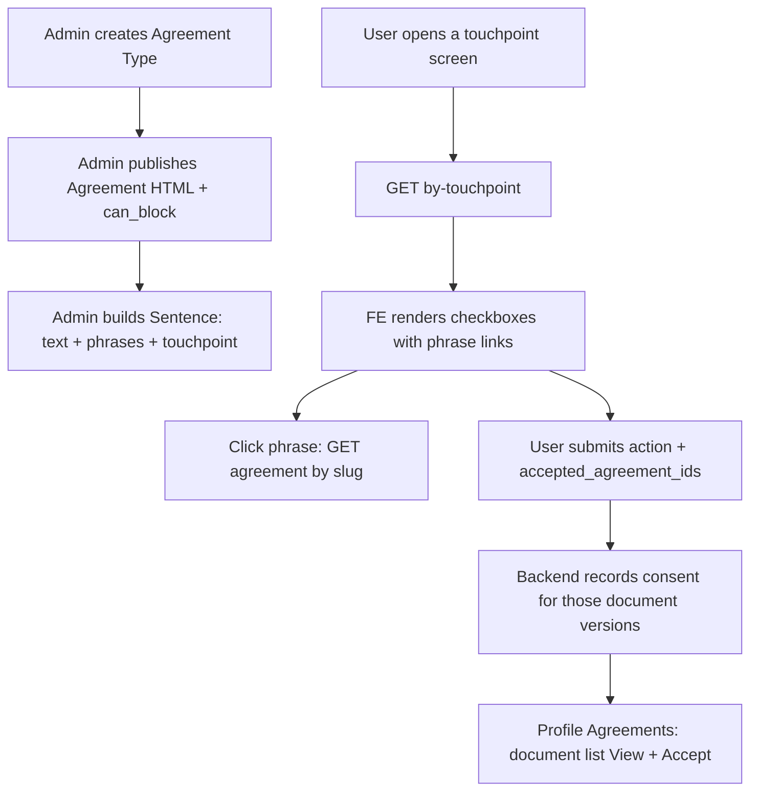

# Taaluma Agreements — Frontend Implementation Spec

This is the only document a frontend developer needs for the new agreement module.

Legal checkbox copy source: `Taaluma_Legal_Implementation_Guide.docx`.  
Demo documents + sentences are already seeded. Do not invent new touchpoint keys.

---

## 1. What changed (read this first)

**Old UI (remove from user-facing and from the Agreement form):**

- `visible_to` (Career Architect / Mentor / …)
- `touchpoints` on the Agreement document
- `is_required` on the Agreement document

Those fields no longer decide who sees what. **Do not send them** from new screens.

**New model:**

| Resource | Who manages it | What it is |
|---|---|---|
| **Agreement Type** | Admin | Folder / lineage. Example: “Terms of Service”. New versions stay under the same type. |
| **Agreement** | Admin | The legal HTML document + version + `can_block`. |
| **Sentence** | Admin — **new page** | The checkbox line the user sees, plus which words link to which document. |

Users never accept a sentence. They accept a **document version**. A sentence is only the checkbox UI.

---

## 2. Three admin pages (staff portal)

Build **three** Legal / Agreements screens. The third one is new.

```
Admin sidebar
  Legal
    ├─ Agreement Types     (existing, keep)
    ├─ Agreements          (existing, simplify form)
    └─ Sentences           (NEW — phrase / checkbox builder)
```

### 2.1 Agreement Types (existing)

Create / list / edit types: name, description, status.

Example types after seed: Terms of Service, Privacy Policy, Mentor Agreement, Refund Policy, …

**APIs (admin token):**

| Action | Method | Path |
|---|---|---|
| List | `GET` | `/api/admin/agreement-types?page=1&limit=20&status=active` |
| Create | `POST` | `/api/admin/agreement-types` `{ name, description, status }` |
| Get one | `GET` | `/api/admin/agreement-types/:id` |
| Update | `PUT` | `/api/admin/agreement-types/:id` |
| Soft delete | `DELETE` | `/api/admin/agreement-types/:id` |

The Sentences page needs this list as a dropdown (“link this phrase to which document type?”).

---

### 2.2 Agreements / documents (existing — change the form)

This page is **only the legal document**.

**Keep on the form**

- Title
- Slug
- Agreement type (dropdown)
- Content (HTML)
- `can_block` (toggle) — if true, users who have not accepted the **latest version** cannot complete the touchpoints that link this document

**Remove from the form**

- Visible to
- Touchpoints
- Required

Publishing a new agreement for an existing type creates a new version. Old version becomes inactive. Users who accepted v1 must accept v2 again.

**APIs (admin token):**

| Action | Method | Path |
|---|---|---|
| List | `GET` | `/api/admin/agreements` |
| Create | `POST` | `/api/admin/agreements` `{ title, slug, content, agreementType, can_block }` |
| Get one | `GET` | `/api/admin/agreements/:id` |
| Update | `PUT` | `/api/admin/agreements/:id` |

Public view (no auth): `GET /api/user/agreements/:id` — `:id` can be Mongo id **or** slug (`terms-of-service`). Render `data.content` as HTML.

---

### 2.3 Sentences — NEW admin page (phrase builder)

This is the page that was missing from the previous spec. **Build it.**

Staff write the exact checkbox line and mark which words open which legal document.

#### List page

- Filter dropdown: touchpoint (plus “All”)
- Table columns:
  - Sentence text
  - Touchpoint
  - Required
  - Linked phrases (chips: `Terms of Service → Terms of Service`)
  - Sort
  - Status
  - Edit / Delete
- Button: **Add sentence**

`GET /api/admin/agreements/sentences`  
`GET /api/admin/agreements/sentences?touchpoint=checkout`

Without `touchpoint`, `data` is a **flat array** of sentence documents (`links.agreementType` populated with `{ _id, name }`).  
With `touchpoint`, `data` is `{ touchpoints, roles, sentences }` and each link includes the **latest** agreement (`_id`, `slug`, `version`).

#### Create / Edit form

| Field | Type | Rules |
|---|---|---|
| `text` | textarea | Full checkbox line. Example: `I agree to the Terms of Service` |
| `touchpoint` | select | **Fixed list only** (section 3). One sentence = one touchpoint. |
| `is_required` | toggle | Default on. Required sentences must be checked before submit. |
| `sort_order` | number | Display order on that screen (0, 1, 2…). |
| `status` | select | `active` / `inactive` (edit only). |
| `links` | repeater | One or more phrase → agreement-type mappings. |

**Each link row**

| Field | Type | Rules |
|---|---|---|
| `phrase` | text | Must be an **exact substring** of `text` (case-sensitive as stored). Example phrase: `Terms of Service` |
| `agreementType` | select | From `GET /api/admin/agreement-types`. Not the agreement version — the type. Backend always resolves the **latest active** document of that type. |

Allow multiple links on one sentence (checkout has two: `digital purchase` → Terms, `refund restrictions` → Refund Policy).

**Live preview on the same form (required)**

Render `text` as a checkbox label. For every `links[].phrase`, turn that substring into an underlined link. Clicking a preview link can open the latest document in a modal (`GET /api/admin/agreements/:slug` after resolving type, or just show the type name in preview).

Example:

```
text:    I understand this is a digital purchase and refund restrictions may apply
links:   digital purchase     → Terms of Service
         refund restrictions  → Refund Policy

preview: ☐ I understand this is a digital purchase and refund restrictions may apply
                                ^^^^^^^^^^^^^^^^^     ^^^^^^^^^^^^^^^^^^^
```

#### Create / update / delete APIs (admin token)

**Create**

```
POST /api/admin/agreements/sentences
```

```json
{
  "text": "I agree to the Terms of Service",
  "touchpoint": "career_architect_registration",
  "is_required": true,
  "sort_order": 0,
  "links": [
    {
      "phrase": "Terms of Service",
      "agreementType": "AGREEMENT_TYPE_OBJECT_ID"
    }
  ]
}
```

**Update**

```
PUT /api/admin/agreements/sentences/:id
```

Same fields, plus optional `status`: `"active"` | `"inactive"`.

**Delete**

```
DELETE /api/admin/agreements/sentences/:id
```

Soft delete. Sentence disappears from user-facing `by-touchpoint`.

#### Admin sentence checklist

1. New sidebar item **Sentences** (or tab under Legal).
2. Phrase builder form with live preview.
3. `phrase` must appear inside `text` — validate on FE before submit.
4. Agreement dropdown = **types**, not versions.
5. Remove Visible to / Touchpoints / Required from the **Agreement document** form. Those now live only on the Sentence.

---

## 3. Fixed touchpoints (do not add new keys)

| Key | Screen | Roles |
|---|---|---|
| `career_architect_registration` | Career Architect signup | Career Architect |
| `institutional_career_architect_registration` | Institutional CA signup | Institutional Career Architect |
| `university_registration` | Institutional email eligibility (separate ICA / university step if you have one) | Institutional Career Architect |
| `mentor_registration` | Mentor signup | Mentor |
| `blueprint_upload` | Blueprint create | Mentor |
| `checkout` | Cart pay | Career Architect, Institutional Career Architect |
| `mentor_payout_setup` | Mentor payout details | Mentor |
| `newsletter` | Newsletter form | All three + guest |
| `contact_form` | Contact us | All three + guest |
| `verified_mentor_application` | Verified mentor apply | Mentor |
| `audio_video_mentoring` | Future audio / video mentoring | Mentor |

Hard-code this select on the Sentence form. Invalid keys return 400 + `valid_touchpoints`.

Role → touchpoints (same map on backend):

- **Career Architect:** `career_architect_registration`, `checkout`, `newsletter`, `contact_form`
- **Institutional Career Architect:** `institutional_career_architect_registration`, `university_registration`, `checkout`, `newsletter`, `contact_form`
- **Mentor:** `mentor_registration`, `blueprint_upload`, `mentor_payout_setup`, `verified_mentor_application`, `audio_video_mentoring`, `newsletter`, `contact_form`

---

## 4. End-to-end flow



### 4.1 Admin writes copy (once)

1. Create type “Terms of Service”.
2. Create agreement: HTML body, slug `terms-of-service`, `can_block: true`.
3. Open **Sentences** page. Add:
   - text = `I agree to the Terms of Service`
   - touchpoint = `career_architect_registration`
   - required = true
   - link phrase `Terms of Service` → type “Terms of Service”

Repeat per guide line. Seed already has the demo set.

### 4.2 User on a touchpoint screen (signup / checkout / upload / form)

1. FE calls `GET /api/user/agreements/by-touchpoint?touchpoint=…`
2. For each `sentences[]`:
   - one checkbox
   - label = `text`
   - each `links[].phrase` is a clickable span
   - click → document modal from `links[].agreement.slug` or `_id`
   - if `is_required`, checkbox is mandatory
3. On submit, collect **unique** `links[].agreement._id`:
   - always include required sentences
   - include optional sentences only if checked
4. Send `{ accepted_agreement_ids: [...] }` on that screen’s action API.
5. Do **not** send sentence ids.

### 4.3 User on Profile → Agreements

Different UI. **No sentences.**

1. `GET /api/admin/agreements/user-consent-status` (portal token).
2. One row per `agreements[]` document.
3. View → open HTML.
4. Accept if `is_accepted === false` (includes old version).
5. Accept all → `POST /api/admin/agreements/accept-all`.

When Legal publishes a new version, the same row flips to Accept again.

### 4.4 Pause

Pause is **per touchpoint**, not whole-app.

- Document has `can_block: true`.
- User has not accepted the **latest** version.
- Only screens whose sentences **link that document** are blocked.
- Example: pending Mentor Agreement blocks mentor signup + payout, not CA checkout.
- Account active/pending only uses **registration** documents. Missing checkout consent does not lock the account.

Each consent-status row includes `touchpoints[]` — use that list to disable those screens until Accept.

---

## 5. User-facing screens (what to build)

Shared component: **`AgreementSentenceList`**

```
props: touchpoint
loads: GET /api/user/agreements/by-touchpoint?touchpoint={touchpoint}
renders: checkboxes + phrase links
exposes: accepted_agreement_ids[]
```

Shared component: **`AgreementDocumentModal`**

```
loads: GET /api/user/agreements/{idOrSlug}
renders: title + data.content HTML
```

| Screen | Touchpoint | Fetch sentences | Submit field on |
|---|---|---|---|
| CA signup | `career_architect_registration` | yes | `POST /api/user/register` |
| ICA signup | `institutional_career_architect_registration` | yes | `POST /api/user/register` (same API; backend detects ICA) |
| University / institutional email step | `university_registration` | yes | same register request **or** that step’s API |
| Mentor signup | `mentor_registration` | yes | `POST /api/admin/register-mentor` |
| Blueprint create | `blueprint_upload` | yes | `POST /api/admin/blueprints` |
| Checkout | `checkout` | yes | `POST /api/user/paystack/pay` and `POST /api/user/referral-wallet/pay` |
| Mentor payout | `mentor_payout_setup` | yes | `POST /api/admin/update-mentor-info` |
| Newsletter | `newsletter` | yes | `POST /api/user/post-subscribers` |
| Contact | `contact_form` | yes | `POST /api/user/post-contact-us` |
| Verified mentor apply | `verified_mentor_application` | yes | `POST /api/admin/verified-mentor-applications` |
| Audio / video mentoring | `audio_video_mentoring` | yes | that future action API |
| Profile → Agreements | — | **no** | `POST /api/admin/agreements/accept` |

Always send current `accepted_agreement_ids` from the GET, even if the user accepted earlier. Safer.

---

## 6. Seeded checkbox copy (demo)

`*` = required. `[brackets]` = `links[].phrase`.

**`career_architect_registration`**
- * I agree to the [Terms of Service]
- * I have read the [Privacy Policy]
- Send me [updates and promotions]

**`institutional_career_architect_registration`**
- * I confirm I am eligible to use the [institutional email] provided
- * I agree to the [Terms of Service]
- * I have read the [Privacy Policy]

**`university_registration`**
- * I confirm I am eligible to use the [institutional email] provided

**`mentor_registration`**
- * I agree to the [Mentor Agreement]
- * I agree to the [Revenue Share Agreement]
- * I agree to the [Content Ownership & Licensing Policy]
- * I agree to the [Community Standards Policy]

**`blueprint_upload`**
- * I own or have rights to [this content]
- * [This content] does not infringe third-party rights
- * I understand Taaluma may remove [non-compliant content]

**`checkout`**
- * I understand this is a [digital purchase] and [refund restrictions] may apply

**`mentor_payout_setup`**
- * I confirm my [payment details] are accurate
- * I understand I am responsible for my [tax obligations]

**`newsletter`**
- Send me updates and [promotional communications]

**`contact_form`**
- * By submitting this form you [consent to being contacted] regarding your enquiry.

**`verified_mentor_application`**
- * I certify that all [information submitted] is true and accurate

**`audio_video_mentoring`**
- * I understand mentoring content is educational and not [regulated professional advice]

Always render API `text`, not this table. This is the current seed so you can build screens offline.

Seeded document slugs: `terms-of-service`, `privacy-policy`, `institutional-access-terms`, `mentor-agreement`, `revenue-share-agreement`, `content-ownership-licensing-policy`, `community-standards-policy`, `refund-policy`, `mentor-verification-rules`, `mentoring-disclaimer`.

---

## 7. API reference

Envelope on every response:

```json
{
  "http_status_code": 200,
  "success": true,
  "data": {},
  "message": "...",
  "timestamp": "2026-08-31T00:00:00.000Z"
}
```

Auth:

| Token | Header | From |
|---|---|---|
| User | `Authorization: Bearer {{userToken}}` | `POST /api/user/login` |
| Portal / mentor | `Authorization: Bearer {{portalToken}}` | `POST /api/admin/login` |
| Admin | `Authorization: Bearer {{adminToken}}` | `POST /api/admin/login` (staff) |

### 7.1 Sentences for a user screen (public)

```
GET /api/user/agreements/by-touchpoint?touchpoint=checkout
GET /api/admin/agreements/by-touchpoint-and-user-type?touchPoint=checkout
```

`userType` query is ignored. Use either path; payload is the same.

```json
{
  "touchpoints": ["checkout"],
  "roles": ["Career Architect", "Institutional Career Architect"],
  "sentences": [
    {
      "_id": "SENTENCE_ID",
      "text": "I understand this is a digital purchase and refund restrictions may apply",
      "touchpoint": "checkout",
      "is_required": true,
      "sort_order": 0,
      "links": [
        {
          "phrase": "digital purchase",
          "agreement_type_id": "TYPE_ID",
          "agreement": {
            "_id": "AGREEMENT_ID",
            "title": "Terms of Service",
            "slug": "terms-of-service",
            "version": "1",
            "can_block": true,
            "agreement_type": { "_id": "TYPE_ID", "name": "Terms of Service" }
          }
        },
        {
          "phrase": "refund restrictions",
          "agreement_type_id": "TYPE_ID",
          "agreement": {
            "_id": "AGREEMENT_ID",
            "title": "Refund Policy",
            "slug": "refund-policy",
            "version": "1",
            "can_block": true
          }
        }
      ]
    }
  ]
}
```

Collect `accepted_agreement_ids` = unique `links[].agreement._id` from required (+ optional checked) sentences.

### 7.2 Read document (public)

```
GET /api/user/agreements/:idOrSlug
```

Use `data.content` (HTML), `data.title`, `data.version`.

### 7.3 Profile list (portal token)

```
GET /api/admin/agreements/user-consent-status
GET /api/admin/agreements/user-consent-status/:type
```

`:type` optional. Default = logged-in role.

```json
{
  "role": "Mentor",
  "touchpoints": ["mentor_registration", "blueprint_upload"],
  "agreements": [
    {
      "_id": "AGREEMENT_ID",
      "title": "Mentor Agreement",
      "slug": "mentor-agreement",
      "current_version": "1",
      "accepted_version": "1",
      "is_accepted": true,
      "is_required": true,
      "can_block": true,
      "accepted_at": "2026-08-31T00:00:00.000Z",
      "touchpoints": ["mentor_registration", "mentor_payout_setup"]
    }
  ],
  "total": 4,
  "accepted_count": 4,
  "pending_count": 0,
  "all_accepted": true
}
```

Ignore `sentences` on this response if present. Profile = documents only.

If `can_block && !is_accepted`, pause `touchpoints` on that row.

### 7.4 Accept (portal token)

```
POST /api/admin/agreements/accept
{ "accepted_agreement_ids": ["AGREEMENT_ID"] }
```

```
POST /api/admin/agreements/accept-all
```

No body. Accepts every latest document for the logged-in role.

Ids must be the **current** latest versions. Stale → 400 `Agreement updated. Please refresh and accept again.` + `data.stale_agreement_ids`.

### 7.5 Admin sentence CRUD (admin token)

| Method | Path | Body |
|---|---|---|
| `GET` | `/api/admin/agreements/sentences` | — |
| `GET` | `/api/admin/agreements/sentences?touchpoint=checkout` | — |
| `POST` | `/api/admin/agreements/sentences` | `{ text, touchpoint, is_required, sort_order, links: [{ phrase, agreementType }] }` |
| `PUT` | `/api/admin/agreements/sentences/:id` | same + `status` |
| `DELETE` | `/api/admin/agreements/sentences/:id` | — |

---

## 8. Errors

| Status | Message | FE |
|---|---|---|
| 400 | `accepted_agreement_ids array is required` | Required boxes not checked |
| 400 | `Required agreements for this step were not accepted` | Show `data.missing_agreement_ids`, refetch sentences |
| 400 | `Agreement updated. Please refresh and accept again.` | Refetch, ask to accept again |
| 400 | `One or more agreements are not applicable for your account type` | Wrong role’s ids |
| 400 | `Invalid touchpoint(s): …` | Bad touchpoint key |
| 404 | `Sentence not found` / `Agreement not found` | Bad id |

---

## 9. Frontend checklists

### User app / portal (Career Architect, ICA, Mentor)

- [ ] Replace old agreement checkboxes with `AgreementSentenceList` on every screen in section 5.
- [ ] Phrase click opens document modal.
- [ ] Required vs optional as per `is_required`.
- [ ] Submit `accepted_agreement_ids` (document ids only).
- [ ] Profile Agreements = document list from `user-consent-status` (View + Accept + Accept all).
- [ ] Pause only the `touchpoints` on a pending `can_block` document.
- [ ] On 400 stale / missing: refetch and retry.
- [ ] Do not send `visible_to`.
- [ ] Do not add new touchpoint keys.

### Admin (staff)

- [ ] **New Sentences page** (list + create/edit + phrase repeater + live preview + delete).
- [ ] Agreement Types page still used (dropdown source for phrase links).
- [ ] Agreement document form: drop Visible to / Touchpoints / Required; keep `can_block`.
- [ ] Phrase is a substring of sentence text (FE validation).
- [ ] Link target is **agreement type**, not a specific version.

---

## 10. Postman

Import `taaluma/docs/Taluma.postman_collection.json` (regenerated with these routes).

Useful folders:

- Admin & Portal → **Agreements** (sentences CRUD, accept, consent status, by-touchpoint)
- Admin & Portal → **Agreement Types**
- User → **Agreements** (`by-touchpoint`, get by id/slug)

Variables: `baseUrl` = `http://localhost:7100`, then `adminToken` / `portalToken` / `userToken` from login.
